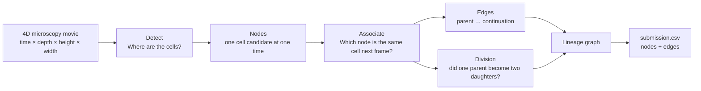

# Biohub Cell Tracking — Learn, Build, Compete

An educational, reproducible project for the Kaggle **[Biohub — Cell Tracking During Development](https://www.kaggle.com/competitions/biohub-cell-tracking-during-development)** competition.

The public repository explains the problem and contains runnable learning baselines. Competition-specific experiment hypotheses, leaderboard strategy, unpublished results, data, and model weights stay private and are excluded by `.gitignore`.

## The whole problem in one picture



The central difficulty is **sparse annotation**. A labeled cell is a confirmed positive, but an unlabeled bright object is not necessarily background. It may be a real cell the annotator did not label. A useful prediction therefore combines three kinds of evidence:

```text
looks like a cell + moves like a cell + persists like a cell
                           ↓
                trustworthy track candidate
```

## Day 1 baseline

[`notebooks/01_eda_and_classical_baseline.ipynb`](notebooks/01_eda_and_classical_baseline.ipynb) is a self-contained Kaggle notebook that:

1. discovers and audits the competition files;
2. visualizes anisotropic 3D microscopy frames;
3. detects candidate cell centers with a 3D Difference of Gaussians;
4. links adjacent frames with physically scaled, gated one-to-one matching;
5. validates graph invariants; and
6. writes `/kaggle/working/submission.csv`.

This is deliberately an interpretable first submission, not the intended final model. Its purpose is to make every step observable and establish a valid end-to-end reference.

## Learning map

Read the **[visual primer](docs/PRIMER.md)** alongside the notebook. Terms in the notebook link back to sections of the primer.

| Stage | Question | Day 1 method | Later direction |
|---|---|---|---|
| Detection | Where are the cells? | 3D Difference of Gaussians | Temporal 3D U-Net ensemble |
| Association | Which cell is which? | Gated greedy matching | Learned link scores + global optimization |
| Division | Did one become two? | No forks yet | Calibrated division classifier |
| Validation | Did it improve? | Structural checks | Movie-level local metric |
| Submission | Can Kaggle score it? | Nodes + edges CSV | Offline, reproducible inference notebook |

## Reproducibility rules

- Never commit competition data, private research, model weights, secrets, or generated submissions.
- Use movie/embryo-level validation; never randomly mix frames from the same movie across train and validation.
- Treat unlabeled regions as unknown unless a method provides defensible negative evidence.
- Record one controlled change per experiment.
- Optimize the official graph metric, not an unrelated proxy alone.
- Keep Kaggle inference offline and within the competition runtime limits.

## Sources and attribution

- [Official competition](https://www.kaggle.com/competitions/biohub-cell-tracking-during-development)
- [Official baseline and evaluation implementation](https://github.com/royerlab/kaggle-cell-tracking-competition)
- [Official metric explanation](https://github.com/royerlab/kaggle-cell-tracking-competition/blob/main/metrics.md)

This repository is an independent educational project. Always consult the current Kaggle rules before using code, data, or pretrained weights.

