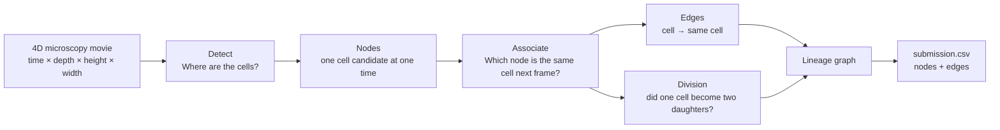

# Learning Cell Tracking with the Biohub Kaggle Competition

I am using the **[Biohub — Cell Tracking During Development](https://www.kaggle.com/competitions/biohub-cell-tracking-during-development)** competition to learn 3D computer vision, tracking, and careful model validation.

My goal is to understand each part well enough to explain it, build a simple version, see where it fails, and then improve it. This repository contains my public learning notes and reproducible notebooks. I keep competition data, model weights, private experiments, and leaderboard strategy out of the repository.

## The problem in one picture



The labels are sparse. A labeled cell is a confirmed cell, but an unlabeled bright object is not automatically background. It may be a real cell that was not labeled.

```text
looks like a cell + moves like a cell + persists like a cell
                           ↓
                stronger evidence of a real cell
```

## My first notebook

[`kaggleNotebooks/dayOneEdaAndBaseline.ipynb`](kaggleNotebooks/dayOneEdaAndBaseline.ipynb) is my first complete pass through the problem. It:

1. finds and checks the competition files;
2. visualizes the 3D microscopy data;
3. detects possible cell centers with a 3D Difference of Gaussians;
4. links nearby detections across adjacent frames;
5. checks the resulting graph; and
6. creates `/kaggle/working/submission.csv`.

This is a simple and understandable starting point. It gives me a complete working pipeline before I add learned detectors, better tracking, and division prediction.

## My second notebook

[`kaggleNotebooks/dayTwoDetectionAndTracking.ipynb`](kaggleNotebooks/dayTwoDetectionAndTracking.ipynb) turns the first result into a measured experiment. It:

1. compares five 3D center-response transformations on annotated training frames;
2. handles sparse annotations without treating every unlabeled location as background;
3. compares greedy, Hungarian, and motion-aware Hungarian linking on complete movies;
4. selects a configuration using local edge validation; and
5. applies the selected configuration to the test movies.

The notebook saves the detector screen, full-movie validation, selected configuration, runtime summary, and final submission as separate output files.

## How I am learning the problem

The **[visual primer](learningNotes/visualPrimer.md)** explains the important concepts behind the notebook.

| Step | Question | First method | What I want to learn next |
|---|---|---|---|
| Detection | Where are the cells? | 3D Difference of Gaussians | Temporal 3D U-Net |
| Association | Which cell is which? | Distance-gated matching | Motion and learned link scores |
| Division | Did one become two? | No divisions yet | Conservative division classification |
| Validation | Did the change help? | Graph checks | Movie-level official metric |
| Submission | Can Kaggle score it? | Nodes and edges CSV | Reliable offline inference |

## Ground rules

- I do not commit competition data, model weights, private research, secrets, or generated submissions.
- I keep complete movies together when creating validation splits.
- I treat unlabeled regions as unknown unless I have a defensible reason to call them background.
- I change one important thing at a time and record the result.
- I use the official graph metric to decide whether an experiment helped.
- I keep Kaggle inference offline and within the competition runtime limits.

## References

- [Competition page](https://www.kaggle.com/competitions/biohub-cell-tracking-during-development)
- [Official baseline and evaluation code](https://github.com/royerlab/kaggle-cell-tracking-competition)
- [Official metric explanation](https://github.com/royerlab/kaggle-cell-tracking-competition/blob/main/metrics.md)

I will check the current competition rules before using outside code, data, or pretrained weights.
