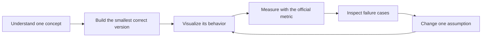

# Visual Primer: From Microscopy Movie to Cell Lineage

This primer explains the public, reusable ideas behind the project. It intentionally does not contain private experiment priorities or leaderboard strategy.

## 1. The data: a 3D world changing through time

Each movie is a stack of 3D images:

```text
time t=0        time t=1        time t=2
┌─────────┐     ┌─────────┐     ┌─────────┐
│ z slices│  →  │ z slices│  →  │ z slices│
└─────────┘     └─────────┘     └─────────┘
```

The array axes are `(T, Z, Y, X)`. A **voxel** is a 3D pixel. The physical voxel spacing is anisotropic: one step in `Z` covers more microns than one step in `Y` or `X`. Distances must therefore be computed in physical units, not raw pixel units.

## 2. Detection: pixels become nodes

A **node** means “a predicted cell center at one timepoint.”

```text
raw 3D image              detector response             selected nodes
    bright blob       →        smooth peak          →       ●
```

### Sparse labels

Only part of the true cell population is annotated:

```text
● annotated = known cell
○ unannotated = unknown, not automatically background
```

This is why ordinary supervised training can fail: telling a model that every unlabeled voxel is background teaches it to suppress genuine unlabeled cells. Suitable approaches include masked losses, positive–unlabeled learning, and carefully constructed negatives.

### Day 1 detector: Difference of Gaussians

**[Difference of Gaussians (DoG)](https://en.wikipedia.org/wiki/Difference_of_Gaussians)** subtracts a strongly blurred image from a lightly blurred image. Slowly varying background largely disappears while blob-like structures remain.

```text
DoG = lightly blurred image − strongly blurred image
```

We retain local peaks using **[non-maximum suppression](https://paperswithcode.com/method/non-maximum-suppression)**: within a small 3D neighborhood, only the strongest response survives.

## 3. Association: nodes become tracks

An **edge** connects a cell at time `t` to its continuation at `t+1`.

```text
t                         t+1
A ●  ───────────────────→  ● A'
B ●       ──────────────→   ● B'
```

A possible edge receives a cost. The simplest cost is physical distance. Stronger costs can combine distance, expected velocity, image appearance, detector confidence, and neighborhood consistency.

The Day 1 tracker uses **gating**: it considers only movements shorter than a physically plausible maximum. Candidate links are sorted by distance and accepted only when neither endpoint is already used. This creates a one-parent/one-child baseline without expensive all-pairs matching.

More advanced alternatives include the **[Hungarian algorithm](https://en.wikipedia.org/wiki/Hungarian_algorithm)**, **[min-cost flow](https://en.wikipedia.org/wiki/Minimum-cost_flow_problem)**, and learned association networks.

## 4. Division: a track becomes a lineage

A division is a directed fork:

```text
                    ● daughter A ──→ ●
                  ↗
● parent ─────────
                  ↘
                    ● daughter B ──→ ●
```

Useful evidence includes two plausible daughter links, daughter persistence, separation geometry, appearance change, and consistency with the parent's recent motion. Because accidental forks are damaging, the Day 1 baseline predicts no divisions. We add them only after local validation can measure their value.

## 5. The official score

Predicted nodes are matched to annotated nodes using physical distance and one-to-one assignment. Correct temporal edges form the main score:

```text
edge Jaccard = TP / (TP + FP + FN)
```

An additional adjustment discourages implausibly high node counts. Division Jaccard is then added with weight `0.1`. Read the exact [official metric specification](https://github.com/royerlab/kaggle-cell-tracking-competition/blob/main/metrics.md); this summary is not a replacement for it.

The practical lesson is that detection and tracking must be optimized together. A beautiful-looking detection map can still produce a poor graph.

## 6. Validation without fooling ourselves

Frames from one movie are highly related. A random frame split leaks visual and biological context. Hold out complete movies or embryos instead:

```text
training movies:   A B C D
validation movies: E F
```

Track at least:

- edge TP, FP, and FN;
- adjusted edge Jaccard;
- division Jaccard;
- annotated-node recall;
- predicted/estimated node-count ratio;
- per-movie results, runtime, and memory.

## 7. Our learning loop



This turns a leaderboard exercise into transferable knowledge: image processing, deep learning, graph optimization, experimental design, and scientific reasoning.

